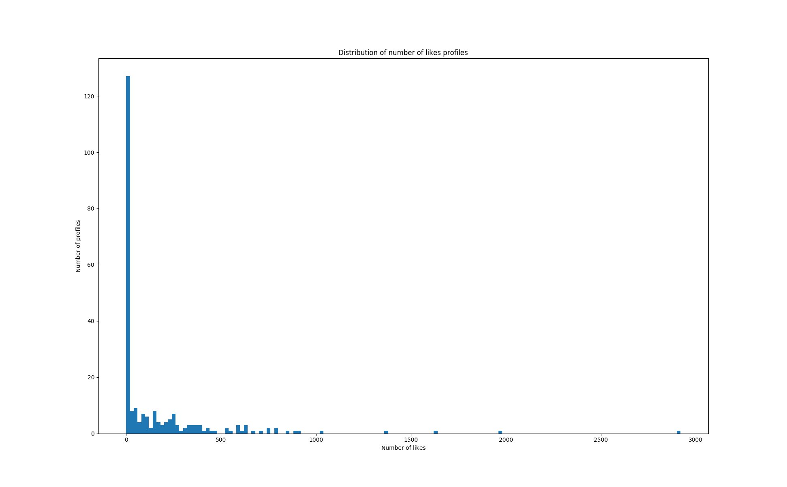

# Alighieri

This is supposed to be guided through heaven by a certain Beatrice?

"Dante claims to have met a 'Beatrice' only twice, on occasions separated by nine years, but was so affected by the meetings that he carried his love for her throughout his life."

Lol Dante.

### Distribution of likes

Drawn from 200+ samples heavily biased towards young Asian in NYC area.



It does not seem ludicrous to model this with a Poisson distribution.

### Profile description stats

Drawn from 600+ samples heavily biased towards young Asian in NYC area.

Appreciate:
```
[('laugh', 98), ('humor', 70), ('sense', 66), ('good', 62), ('kind', 58), ('things', 37), ('genuine', 35), ('conversation', 34), ('new', 33), ('great', 33)]
```

I am:
```
[('new', 80), ('passionate', 44), ('good', 39), ('things', 35), ('person', 34), ('lover', 32), ('life', 31), ('foodie', 29), ('someone', 24), ('little', 22)]
```

Interested in:
```
[('food', 85), ('music', 67), ('things', 66), ('movies', 54), ('friends', 50), ('city', 44), ('people', 36), ('restaurants', 36), ('coffee', 34), ('travel', 33)]
```

### [CMB app protocol](scratch.md)

### Disclaimer

For research only.

The program may be able to dig up certain portions of what a user tells CMB, but should not be used as such.
